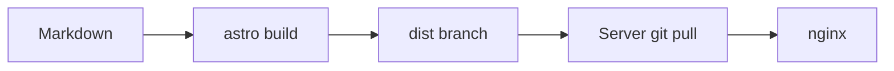

Dieser Beitrag ist absichtlich lang. Er erklärt Schritt für Schritt, wie die
Seite gebaut, ausgeliefert und gewartet wird – und dient nebenbei als Beispiel
dafür, wie sich der Lesefortschritts-Balken oben und das Inhaltsverzeichnis
rechts verhalten, wenn wirklich etwas zu scrollen da ist.

## Warum überhaupt selbst bauen

Es gibt fertige Blog-Plattformen, und für die meisten Leute sind sie die
richtige Wahl. Der Grund, hier trotzdem alles selbst zu machen, ist nicht
Ideologie, sondern eine Handvoll konkreter Anforderungen: kein Tracking, keine
Cookies, keine externen Skripte, volle Kontrolle über das Markup, und ein
Deployment, das ohne laufenden Anwendungsserver auskommt. Eine statische Seite
erfüllt das alles, und der Aufwand hält sich in Grenzen, wenn man die Teile
sauber trennt.

Die Trennung sieht so aus: Es gibt ein **Theme** als eigenständiges Paket und
ein **Blog-Repo**, das nur Konfiguration und Inhalte enthält. Das Theme kann
sich weiterentwickeln, ohne dass die Inhalte davon berührt werden, und
umgekehrt.

## Das Theme als Paket

Das Theme heißt AstroBlogTheme und liegt in einem eigenen Repository. Das
Blog-Repo bindet es nicht als kopierten Ordner ein, sondern als
Abhängigkeit – direkt von GitHub, ungefähr so, wie man in Hugo ein Modul
importiert:

```json
{
  "dependencies": {
    "astro-blog-theme": "github:eskopp/AstroBlogTheme#v0.2.22"
  }
}
```

Die Versionsnummer hinter dem `#` zeigt auf ein Git-Tag. Dadurch ist genau
festgelegt, welcher Stand des Themes gebaut wird, und ein Update ist ein
bewusster Schritt: Tag hochziehen, neu bauen, fertig.

Technisch ist das Theme eine **Astro-Integration**. Beim Start hängt es sich in
die Konfiguration ein, injiziert Routen (`/blog`, `/tags`, `/rss.xml`,
`/feed.json`, `/llms.txt`, die Fehlerseiten und ein paar mehr), registriert die
nötigen Markdown-Plugins und stellt Layouts und Komponenten bereit. Das
Blog-Repo besteht am Ende aus einer `astro.config.mjs`, einer
Content-Collection-Definition, ein paar eigenen Seiten und den Beiträgen.

### Konfiguration an einer Stelle

Alles, was das Theme über die konkrete Seite wissen muss, steht in einem Objekt
in der `astro.config.mjs`: Titel, Beschreibung, Navigation, Footer-Links,
Lizenz, Sprachen, welche optionalen Features an sind. Das Theme reicht dieses
Objekt über ein virtuelles Modul an alle Komponenten weiter, sodass es nirgends
doppelt gepflegt werden muss.

## Inhalte und das Sprachmodell

Jeder Beitrag ist eine Markdown-Datei. Die Ablage folgt einer festen Regel:
**ein Ordner pro Beitrag, darin eine Datei pro Sprache, benannt nach der
Sprache.**

```
src/content/blog/
  wie-dieser-blog-funktioniert/
    de.md
    en.md
  hello-world/
    de.md
    en.md
```

Der Ordnername verknüpft die Übersetzungen automatisch. Der Sprachumschalter im
Header springt zwischen der deutschen und der englischen Fassung eines Beitrags,
ohne dass man das von Hand verdrahten muss.

### Slugs tragen die Sprache

Es gibt bewusst **kein** `/en/`-Präfix in den URLs. Stattdessen bekommt jede
Sprachfassung ihren eigenen Slug: die deutsche Version dieses Beitrags liegt
unter `/blog/wie-dieser-blog-funktioniert/`, die englische unter
`/blog/how-this-blog-works/`. Beide leben im selben `/blog/`-Namensraum. Der
Slug kommt aus dem Feld `urlSlug` im Frontmatter, oder – wenn das fehlt – aus
dem Ordnernamen.

Die Übersichtsseiten (`/blog`, `/tags`, die Feeds) zeigen die Hauptsprache. Wer
englische Beiträge lesen will, kommt über den Sprachumschalter auf einem Beitrag
oder über die englische Startseite dorthin.

### Frontmatter

Ein Beitrag braucht `title`, `description` und `pubDate`. Optional sind unter
anderem:

- `updatedDate` – zeigt „aktualisiert am …" in der Meta-Zeile
- `tags` – Hugo-artige Tag-Seiten unter `/tags/`
- `draft` – versteckt den Beitrag
- `ai` – blendet eine kleine „AI"-Markierung ein, wenn beim Schreiben KI genutzt
  wurde
- `toc` – überschreibt pro Beitrag, ob das Inhaltsverzeichnis erscheint
- `translationKey` – überschreibt die automatische Übersetzungs-Verknüpfung

## Die Build- und Deploy-Pipeline

Hier wird es interessant, weil auf dem Server **nichts gebaut wird**. Der Server
kennt Astro nicht und hat kein Node installiert.

### Schritt 1: Push auf `main`

Jeder Push auf den `main`-Branch des Blog-Repos startet einen
GitHub-Actions-Workflow.

### Schritt 2: Bauen

Der Workflow installiert die Abhängigkeiten (inklusive des Themes von GitHub),
führt `astro build` aus und erhält einen Ordner `dist/` mit fertigem HTML, CSS
und den paar kleinen JavaScript-Bündeln.

### Schritt 3: In den `dist`-Branch schieben

Statt den `dist`-Ordner irgendwohin hochzuladen, committet der Workflow ihn in
einen separaten Branch namens `dist`. Dieser Branch enthält also immer den
aktuellen fertig gebauten Stand der Seite, mit Historie. Ein Ruleset auf GitHub
sorgt dafür, dass niemand von Hand daran herumschreibt.

### Schritt 4: Der Server zieht

Auf dem Webserver liegt ein flacher Klon genau dieses `dist`-Branch unter
`/var/www/astroblog`. Ein `git fetch --depth 1` plus `git reset --hard` holt den
neuen Stand. nginx liefert die Dateien direkt aus – kein Build, kein Neustart,
kein Anwendungsprozess.

### Schritt 5: Der Spiegel

Derselbe Workflow spiegelt zusätzlich das komplette Repo auf eine selbst
gehostete GitLab-Instanz. Das ist reine Vorsichtsmaßnahme: eine zweite,
unabhängige Kopie von Code und Historie.

## Was das Theme mitbringt

Ein Rundgang durch die Features, die im Beitrag oben schon teilweise sichtbar
sind.

### Hell und dunkel

Ein Umschalter oben rechts. Die Auswahl landet im `localStorage` des Browsers,
wird nie an den Server geschickt und ist beim nächsten Besuch wieder da. Ohne
gespeicherte Auswahl richtet sich die Seite nach der Systemeinstellung. Ein
winziges Inline-Script setzt das Thema, bevor die Seite gezeichnet wird, damit
nichts flackert.

### Suche

Beim Bauen entsteht eine Datei `/search.json` mit Titel, Beschreibung, Tags und
einem gekürzten Klartext-Auszug jedes Beitrags. Das Suchfeld im Header lädt
diese Datei einmalig beim ersten Fokus und filtert dann komplett im Browser.
Die Suchbegriffe verlassen den Rechner nicht.

### Tags

`/tags/` listet alle Tags mit Anzahl, `/tags/<tag>/` die Beiträge dazu. Die
Tags an einem Beitrag sind Links dorthin. Die URL-Form der Tags folgt Hugos
Regel: kleingeschrieben, Leerzeichen zu Bindestrichen.

### Feeds und Maschinen-lesbares

- `/rss.xml` – klassischer RSS-Feed
- `/feed.json` – JSON Feed 1.1
- `/llms.txt` – eine Markdown-Landkarte der Seite nach dem llmstxt.org-Format,
  mit einem Eintrag pro Beitrag
- `/sitemap-index.xml` – für Suchmaschinen
- JSON-LD im `<head>` – strukturierte Daten für `WebSite` und, auf Beiträgen,
  `BlogPosting`

### Lesehilfen

Lesezeit in der Meta-Zeile, ein Inhaltsverzeichnis ab drei Überschriften (auf
dem Desktop als klebrige Seitenleiste rechts, sonst als Kasten über dem Text),
Anker-Links beim Hovern über Überschriften, ein „nach oben"-Knopf nach ein paar
Bildschirmhöhen Scrollen – und eben der Fortschrittsbalken ganz oben.

### Code

Syntax-Highlighting über Shiki mit zwei Themes, hell und dunkel, die dem
Umschalter folgen. Jeder Block hat Zeilennummern und einen Copy-Knopf. Der
Copy-Knopf kopiert nur den Code, ohne die Zeilennummern.

```python
from functools import lru_cache


@lru_cache(maxsize=None)
def fib(n: int) -> int:
    return n if n < 2 else fib(n - 1) + fib(n - 2)
```

### Diagramme

Mermaid-Blöcke werden im Browser gerendert, aus einem selbst gehosteten Bündel,
das nur auf Seiten mit einem Diagramm geladen wird. Beim Umschalten von hell auf
dunkel wird das Diagramm neu gezeichnet.



### Formeln

Mathe wird zur Build-Zeit mit KaTeX gesetzt. Im ausgelieferten HTML steht
fertiges Markup, für die Anzeige braucht es kein JavaScript. Chemie geht über
die mhchem-Erweiterung:

$$\ce{2 H2 + O2 -> 2 H2O}$$

Physik ist normale LaTeX-Notation:

$$i\hbar\,\frac{\partial}{\partial t}\lvert\psi\rangle = \hat{H}\lvert\psi\rangle$$

### Fehlerseiten

Eigene Seiten für 404, 403, 500, 503 und 429, alle mit `noindex`. nginx zeigt
sie über seine `error_page`-Direktiven an. Auf diesem Blog sind sie bewusst nur
auf Englisch.

### Externe Links

Ein kleines Script prüft nach dem Laden jeden Link: zeigt er auf eine andere
Origin – andere Domain oder Subdomain – bekommt er `target="_blank"` und
`rel="noopener noreferrer"`. Links innerhalb der Seite bleiben unangetastet.

## Hosting

Die Seite läuft auf einem kleinen Server. nginx liefert die statischen Dateien
aus, das TLS-Zertifikat kommt von Let's Encrypt und erneuert sich selbst. Jede
der Domains auf dem Server hat ihr eigenes Zertifikat, nicht ein gemeinsames
SAN-Zertifikat.

In den Server-Logdateien landen die üblichen Zugriffsdaten. Sie werden nach
spätestens 14 Tagen gelöscht, und Fail2ban sperrt auffällige Adressen
vorübergehend. Details stehen in der Datenschutzerklärung.

## Wie „offline" das Ganze ist

Alles wird vom eigenen Server ausgeliefert. Es gibt keinen einzigen Aufruf an
einen fremden Server – keine CDN-Skripte, keine externen Schriftarten, kein
Analyse-Dienst. Die genannte „Inter"-Schrift wird nur verwendet, wenn sie lokal
installiert ist; nachgeladen wird nichts.

Was es **nicht** gibt, ist ein Service Worker. Ohne Verbindung zum Server sieht
man nichts. Echtes Offline-Lesen wäre eine eigene Ausbaustufe.

## Was noch aussteht

Ein paar Dinge stehen auf der Liste: Pagination auf den Übersichtsseiten, ein
Archiv nach Jahr, ein automatischer Pull auf dem Server statt des manuellen
Schritts, ein Feinschliff der nginx-Konfiguration (HTTP/2, Sicherheits-Header,
Caching für die gehashten Assets) und vielleicht der Service Worker für Offline.

Mehr dazu, wenn es soweit ist.

> [!READMORE]
> [Syntax-Highlighting](/blog/syntax-highlighting/)
