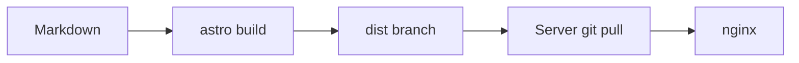

This post is deliberately long. It walks through how the site is built, served
and maintained — and doubles as an example of how the reading-progress bar at the
top and the table of contents on the right behave when there is actually
something to scroll.

## Why build it yourself

There are ready-made blogging platforms, and for most people they are the right
call. The reason to do everything by hand here is not ideology but a handful of
concrete requirements: no tracking, no cookies, no external scripts, full
control over the markup, and a deployment that works without a running
application server. A static site covers all of that, and the effort stays
small if the pieces are kept apart.

The split looks like this: there is a **theme** as a standalone package and a
**blog repo** that holds only configuration and content. The theme can evolve
without touching the content, and the other way round.

## The theme as a package

The theme is called AstroBlogTheme and lives in its own repository. The blog
repo does not vendor it as a copied folder — it depends on it, straight from
GitHub, roughly the way you import a module in Hugo:

```json
{
  "dependencies": {
    "astro-blog-theme": "github:eskopp/AstroBlogTheme#v0.2.23"
  }
}
```

The version after the `#` points at a git tag. That pins exactly which state of
the theme gets built, and an update is a deliberate step: bump the tag, rebuild,
done.

Technically the theme is an **Astro integration**. On start-up it hooks into the
config, injects routes (`/blog`, `/tags`, `/rss.xml`, `/feed.json`, `/llms.txt`,
the error pages and a few more), registers the markdown plugins it needs and
provides the layouts and components. What is left in the blog repo is an
`astro.config.mjs`, a content-collection definition, a couple of own pages and
the posts.

### Configuration in one place

Everything the theme needs to know about the concrete site sits in one object
in `astro.config.mjs`: title, description, navigation, footer links, licence,
languages, which optional features are on. The theme passes this object to every
component through a virtual module, so it never has to be kept in two places.

## Content and the language model

Every post is a markdown file. The layout follows a fixed rule: **one folder per
post, one file per language, named after the language.**

```
src/content/blog/
  how-this-blog-works/
    de.md
    en.md
  hello-world/
    de.md
    en.md
```

The folder name links the translations automatically. The language switcher in
the header jumps between the German and English version of a post without any
manual wiring.

### Slugs carry the language

There is deliberately **no** `/en/` prefix in the URLs. Instead each language
version gets its own slug: the German version of this post is at
`/blog/wie-dieser-blog-funktioniert/`, the English one at
`/blog/how-this-blog-works/`. Both live in the same `/blog/` namespace. The slug
comes from the `urlSlug` frontmatter field, or — if that is missing — from the
folder name.

The listing pages (`/blog`, `/tags`, the feeds) show the primary language.
Readers who want English posts get there via the language switcher on a post or
via the English home page.

### Frontmatter

A post needs `title`, `description` and `pubDate`. Optional, among others:

- `updatedDate` — shows "updated …" in the meta line
- `tags` — Hugo-style tag pages under `/tags/`
- `draft` — hides the post
- `ai` — shows a small "AI" marker when AI was used while writing
- `toc` — overrides per post whether the table of contents appears
- `translationKey` — overrides the automatic translation link

## The build and deploy pipeline

This is the interesting part, because **nothing is built on the server**. The
server does not know Astro and has no Node installed.

### Step 1: push to `main`

Every push to the `main` branch of the blog repo starts a GitHub Actions
workflow.

### Step 2: build

The workflow installs the dependencies (including the theme from GitHub), runs
`astro build` and gets a `dist/` folder with finished HTML, CSS and the few
small JavaScript bundles.

### Step 3: push to the `dist` branch

Instead of uploading the `dist` folder somewhere, the workflow commits it to a
separate branch called `dist`. So that branch always holds the current
fully-built state of the site, with history. A ruleset on GitHub makes sure
nobody edits it by hand.

### Step 4: the server pulls

On the web server there is a shallow clone of exactly that `dist` branch under
`/var/www/astroblog`. A `git fetch --depth 1` plus `git reset --hard` picks up
the new state. nginx serves the files directly — no build, no restart, no
application process.

### Step 5: the mirror

The same workflow also mirrors the whole repo to a self-hosted GitLab instance.
That is pure precaution: a second, independent copy of code and history.

## What the theme brings

A tour through the features, some of which are already visible in the post
above.

### Light and dark

A toggle in the top right. The choice lands in the browser's `localStorage`, is
never sent to the server and is there again on the next visit. Without a saved
choice the site follows a configurable default. A tiny inline script sets the
theme before the page is painted, so nothing flickers.

### Search

The build produces a `/search.json` file with the title, description, tags and a
trimmed plain-text excerpt of every post. The search box in the header loads
that file once on first focus and then filters entirely in the browser. The
search terms never leave the machine.

### Tags

`/tags/` lists every tag with a count, `/tags/<tag>/` the posts for it. The tags
on a post are links there. The URL form of the tags follows Hugo's rule:
lowercase, spaces to hyphens.

### Feeds and machine-readable output

- `/rss.xml` — a classic RSS feed
- `/feed.json` — JSON Feed 1.1
- `/llms.txt` — a markdown map of the site in the llmstxt.org format, one entry
  per post
- `/sitemap-index.xml` — for search engines
- JSON-LD in the `<head>` — structured data for `WebSite` and, on posts,
  `BlogPosting`

### Reading aids

Reading time in the meta line, a table of contents from three headings on
(a sticky sidebar on the right on desktop, a box above the text otherwise),
anchor links on hovering a heading, a back-to-top button after scrolling a few
screen heights — and the progress bar right at the top.

### Code

Syntax highlighting via Shiki with two themes, light and dark, that follow the
toggle. Every block has line numbers and a copy button. The copy button copies
only the code, without the line numbers.

```python
from functools import lru_cache


@lru_cache(maxsize=None)
def fib(n: int) -> int:
    return n if n < 2 else fib(n - 1) + fib(n - 2)
```

### Diagrams

Mermaid blocks render in the browser, from a self-hosted bundle that is only
loaded on pages with a diagram. On switching from light to dark the diagram is
redrawn.



### Formulas

Math is typeset at build time with KaTeX. The delivered HTML contains finished
markup; no JavaScript is needed to display it. Chemistry goes through the mhchem
extension:

$$\ce{2 H2 + O2 -> 2 H2O}$$

Physics is plain LaTeX notation:

$$i\hbar\,\frac{\partial}{\partial t}\lvert\psi\rangle = \hat{H}\lvert\psi\rangle$$

### Error pages

Own pages for 404, 403, 500, 503 and 429, all with `noindex`. nginx shows them
through its `error_page` directives. On this blog they are deliberately
English-only.

### External links

A small script checks every link after load: if it points to another origin —
a different domain or subdomain — it gets `target="_blank"` and
`rel="noopener noreferrer"`. Links within the site are left alone.

## Hosting

The site runs on a small server. nginx serves the static files, the TLS
certificate comes from Let's Encrypt and renews itself. Each of the domains on
the server has its own certificate, not one shared SAN certificate.

The server log files hold the usual access data. It is deleted after 14 days at
the latest, and Fail2ban temporarily blocks suspicious addresses. Details are in
the privacy policy.

## How "offline" this is

Everything is served from the site's own server. There is not a single request
to a third-party server — no CDN scripts, no external fonts, no analytics
service. The "Inter" font mentioned in the CSS is only used if it is installed
locally; nothing is downloaded.

What there is **not** is a service worker. Without a connection to the server
you see nothing. True offline reading would be its own build-out.

## What's still open

A few things are on the list: pagination on the listing pages, an archive by
year, an automatic pull on the server instead of the manual step, a polish of
the nginx configuration (HTTP/2, security headers, caching for the hashed
assets) and maybe the service worker for offline.

More on that when it happens.

> [!READMORE]
> [Syntax highlighting](/blog/code-highlighting/)
