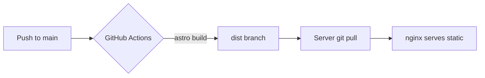
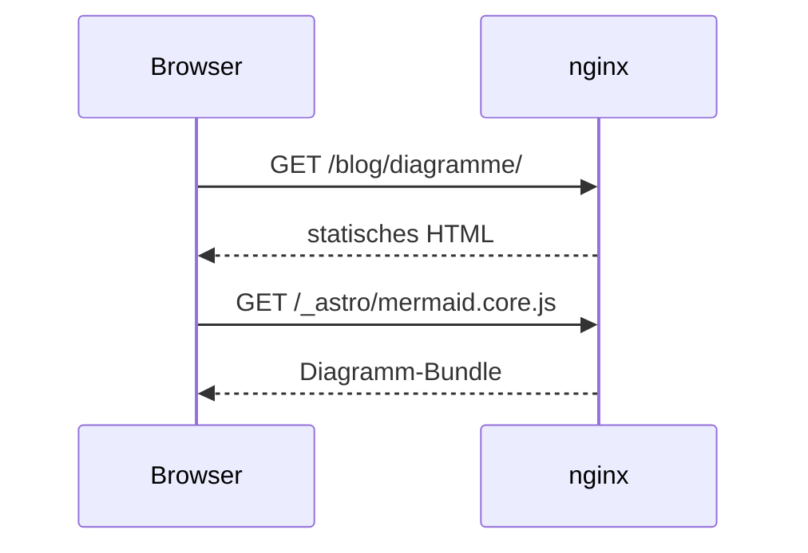

Mermaid-Diagramme werden im Browser gerendert – aus einem selbst gehosteten
Bundle, nur auf Seiten mit einem Diagramm, und sie folgen dem Hell-/Dunkel-Umschalter.

## Der Deploy-Weg

## Ein Request

