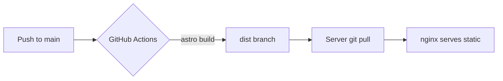
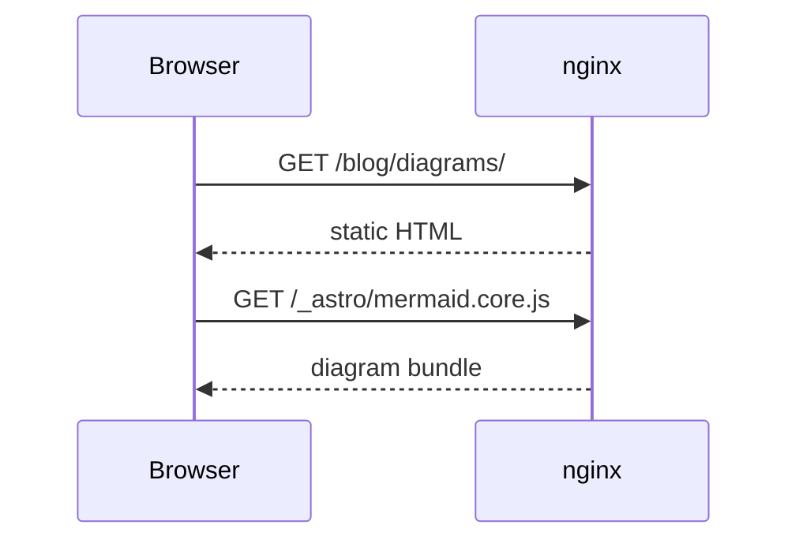

Mermaid diagrams render in the browser — from a self-hosted bundle, only on
pages that contain a diagram, and they follow the light/dark toggle.

## The deploy path

```mermaid
flowchart LR
    A[Push to main] --> B{GitHub Actions}
    B -->|astro build| C[dist branch]
    C --> D[Server git pull]
    D --> E[nginx serves static]
```

## One request

```mermaid
sequenceDiagram
    participant Browser
    participant nginx
    Browser->>nginx: GET /blog/diagrams/
    nginx-->>Browser: static HTML
    Browser->>nginx: GET /_astro/mermaid.core.js
    nginx-->>Browser: diagram bundle
```
