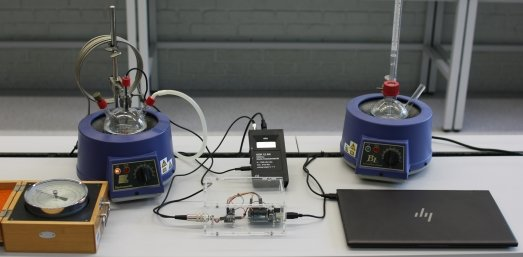

Für das Fach Grundpraktikum der Physik 1[^2] dürfen wir verschiedene Experimente im Physiklabor absolvieren. Der Artikel wird kein Protokoll. Ich möchte eig nur ein wenig über das Experiment schreiben. Leider habe ich damals vergessen, Bilder von dem Experiment zu machen.

[^3]

Im Grunde ging es um zwei Punkte:

1. molare Verdampfungsenthalpie
2. Höhenbestimmung über die Wassertemperatur

### molare Verdampfungsenthalpie
Die molare Verdampfungsenthalpie

$$
\left[Q_{m,v}\right] = \frac{\text{J}}{\text{mol}}
$$

ist eig nur die Energie, die man benötigt, um 1 Mol Flüssigkeit vollständig in einen gasförmigen Zustand zu überführen. Bei isobarer und isothermer Prozessführung entspricht $Q_{m,v}$ der molaren Verdampfungsenthalpie $\Delta H_v$.
Als Ausgangspunkt nimmt man die Clausius-Clapeyron-Gleichung

$$
\frac{dp_S}{dT} = \frac{Q_{m,v}}{T\left(V_{m,G} - V_{m,Fl}\right)}
$$

Hinreichend weit unterhalb des kritischen Punktes ist das Molvolumen der Flüssigkeit gegenüber dem des Dampfes vernachlässigbar, also $V_{m,G} - V_{m,Fl} \approx V_{m,G}$. Nimmt man zusätzlich an, dass sich der Wasserdampf wie ein ideales Gas verhält ($p_S V_{m,G} = RT$), bekommt man die Gleichung

$$
\frac{dp_S}{dT} = \frac{\Delta H_v}{R}\frac{p_S}{T^2}
$$

Diese Gleichung ist die für unser Experiment relevante. Integriert man diese mit den Anfangsbedingungen $p_{S,0} = p_S(T_0)$, erhält man daraus

$$p_S(T) = p_{S,0} \exp\left[-\frac{\Delta H_v}{R}\left(\frac{1}{T} - \frac{1}{T_0}\right)\right]$$

Titelbild[^1]: Photo by Ivan S from Pexels.

[^1]: [https://www.pexels.com/photo/a-person-pouring-liquid-in-flat-bottomed-flask-9629702/](https://www.pexels.com/photo/a-person-pouring-liquid-in-flat-bottomed-flask-9629702/) (abgerufen am 25.09.2026)

[^2]: [https://www.tu-ilmenau.de/universitaet/fakultaeten/fakultaet-mathematik-und-naturwissenschaften/profil/institute-und-fachgebiete/institut-fuer-physik/profil/physikalisches-grundpraktikum](https://www.tu-ilmenau.de/universitaet/fakultaeten/fakultaet-mathematik-und-naturwissenschaften/profil/institute-und-fachgebiete/institut-fuer-physik/profil/physikalisches-grundpraktikum)

[^3]: Foto: Dr. Anke Sander, TU Ilmenau. [https://www.tu-ilmenau.de/universitaet/fakultaeten/fakultaet-mathematik-und-naturwissenschaften/profil/institute-und-fachgebiete/institut-fuer-physik/profil/physikalisches-grundpraktikum/uebersicht/waermelehre](https://www.tu-ilmenau.de/universitaet/fakultaeten/fakultaet-mathematik-und-naturwissenschaften/profil/institute-und-fachgebiete/institut-fuer-physik/profil/physikalisches-grundpraktikum/uebersicht/waermelehre)

