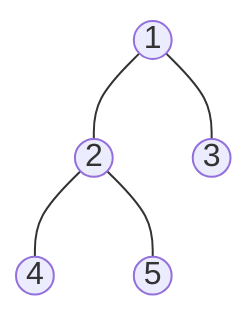

import VideoEmbed from '../../../components/VideoEmbed.astro';

Der Induktionsbeweis ist der erste Beweis überhaupt, den man im Informatik-Studium lernt. Er beweist eine Aussage für unendlich viele Fälle mit nur zwei endlichen Schritten. Der Beweis beruht auf der Induktionseigenschaft der natürlichen Zahlen[^2].

$$
\sum_{i=1}^{n} i = \frac{n(n+1)}{2}
$$

für alle $n \in \mathbb{N}$. Das Summenzeichen ist nur eine Kurzschreibweise für $1 + 2 + 3 + \dots + n$.

## Herleitung

Schreibt man die Summe $S$ einmal vorwärts und einmal rückwärts untereinander, ergibt jedes Paar $n + 1$:

$$
\begin{aligned}
S &= 1 + 2 + \dots + (n-1) + n \\
S &= n + (n-1) + \dots + 2 + 1 \\
2S &= (n+1) + (n+1) + \dots + (n+1)
\end{aligned}
$$

Das sind $n$ Summanden, jeder gleich $n + 1$:

$$
2S = n(n+1)
$$

Daraus folgt:

$$
S = \frac{n(n+1)}{2}
$$

<VideoEmbed platform="youtube" id="0QKB3i2tHNA" title="Die Vermessung der Welt - Der junge Gauß in der Schule" />
Video[^3]: „Die Vermessung der Welt - Der junge Gauß in der Schule“ von Das Bergische Bärchen auf YouTube.

## Aufbau des Beweises

### Grundlagen
Der Beweis gliedert sich im Grunde in fünf Schritte:
- Induktionsanfang
    - Wir zeigen, dass die Aussage für den kleinsten Fall stimmt.
- Induktionsvoraussetzung
    - Wir nehmen an, dass die Aussage für ein beliebiges $n$ gilt.
- Induktionsschritt
    - Wir zeigen, dass die Aussage dann auch für $n + 1$ gilt.
- Induktionsbehauptung
    - Das ist die Aussage, die wir für $n + 1$ zeigen wollen.
- Induktionsbeweis
    - Wir rechnen die Behauptung mit Hilfe der Voraussetzung nach.

## Der Beweis
### Induktionsanfang

Im Induktionsanfang schauen wir, ob die Formel für den kleinsten Fall stimmt. Das ist hier $n = 1$. Zur Sicherheit rechnen wir auch $n = 2$ und $n = 3$ nach.

Für $n = 1$:

$$
1 = \frac{1 \cdot (1+1)}{2} \;\Leftrightarrow\; 1 = \frac{2}{2} \;\Leftrightarrow\; 1 = 1
$$

Für $n = 2$:

$$
1 + 2 = \frac{2 \cdot (2+1)}{2} \;\Leftrightarrow\; 3 = \frac{6}{2} \;\Leftrightarrow\; 3 = 3
$$

Für $n = 3$:

$$
1 + 2 + 3 = \frac{3 \cdot (3+1)}{2} \;\Leftrightarrow\; 6 = \frac{12}{2} \;\Leftrightarrow\; 6 = 6
$$

In allen drei Fällen sind beide Seiten gleich. Für den Beweis reicht eigentlich schon $n = 1$. Die anderen beiden Fälle zeigen nur, dass die Formel auch weiter stimmt.

### Induktionsvoraussetzung

Jetzt nehmen wir an, dass die Formel für ein beliebiges $n$ stimmt. Das müssen wir nicht beweisen, wir setzen es einfach voraus:

$$
\sum_{i=1}^{n} i = \frac{n(n+1)}{2}
$$

Mit dieser Annahme arbeiten wir im nächsten Schritt weiter.

### Induktionsschritt

Jetzt wollen wir zeigen, dass die Formel dann auch für den nächsten Wert $n + 1$ stimmt. Dazu addieren wir auf beiden Seiten der Voraussetzung $n + 1$:

$$
\sum_{i=1}^{n} i + (n+1) = \frac{n(n+1)}{2} + (n+1)
$$

### Induktionsbehauptung

Wenn wir in der Formel überall $n + 1$ statt $n$ einsetzen, bekommen wir die Behauptung. Das ist genau das, was wir zeigen wollen:

$$
\sum_{i=1}^{n+1} i = \frac{(n+1)\left((n+1)+1\right)}{2} = \frac{(n+1)(n+2)}{2}
$$

### Induktionsbeweis

Jetzt müssen wir nur noch zeigen, dass die rechte Seite aus dem Induktionsschritt gleich der rechten Seite der Behauptung ist. Dafür klammern wir $n + 1$ aus und fassen zusammen:

$$
\begin{aligned}
\frac{n(n+1)}{2} + (n+1) &= \frac{n(n+1)}{2} + \frac{2(n+1)}{2} \\
&= \frac{n(n+1) + 2(n+1)}{2} \\
&= \frac{(n+1)(n+2)}{2}
\end{aligned}
$$

Das ist genau die rechte Seite der Behauptung. Damit gilt die Formel für $n + 1$, wenn sie für $n$ gilt. Zusammen mit dem Induktionsanfang stimmt sie also für alle $n \in \mathbb{N}$.

## Weiteres Beispiel: Bäume

Die Induktion funktioniert nicht nur bei Formeln mit Zahlen. Wir können damit auch Aussagen über Strukturen beweisen, die wir Stück für Stück aufbauen. Ein Beispiel dafür sind Bäume aus der Informatik. Ein Baum ist ein Graph, der zusammenhängend ist und keinen Kreis enthält. Wir zeigen:

Ein Baum mit $n$ Knoten hat genau $n - 1$ Kanten.

Hier ist ein Beispiel mit $n = 5$ Knoten und $4$ Kanten. Die Knoten 3, 4 und 5 sind Blätter, sie haben nur eine Kante.

**Induktionsanfang:** Für $n = 1$ gibt es nur einen Knoten und keine Kante. Das sind $1 - 1 = 0$ Kanten, die Aussage stimmt.

**Induktionsvoraussetzung:** Wir nehmen an, dass jeder Baum mit $n$ Knoten genau $n - 1$ Kanten hat.

**Induktionsschritt:** Wir nehmen einen beliebigen Baum mit $n + 1$ Knoten. Jeder Baum mit mindestens zwei Knoten hat ein Blatt, also einen Knoten mit nur einer Kante. Das liegt daran, dass es keinen Kreis gibt. Wenn man im Baum immer weiterläuft, kommt man nie zu einem Knoten zurück und der Weg muss irgendwann an einem Blatt enden. Wenn wir dieses Blatt mit seiner Kante entfernen, bleibt ein Baum mit $n$ Knoten übrig.

**Induktionsbehauptung:** Der Baum mit $n + 1$ Knoten hat genau $n$ Kanten.

**Induktionsbeweis:** Der kleinere Baum hat nach der Voraussetzung $n - 1$ Kanten. Dazu kommt die eine Kante, die wir mit dem Blatt entfernt haben:

$$
(n-1) + 1 = n
$$

Das ist genau die Behauptung. Damit stimmt die Aussage für alle Bäume.

Titelbild[^1]: Photo by Gabby K from Pexels.

[^2]: [https://de.wikipedia.org/wiki/Peano-Axiome](https://de.wikipedia.org/wiki/Peano-Axiome) (abgerufen am 01.10.2026)

[^3]: [https://www.youtube.com/watch?v=0QKB3i2tHNA](https://www.youtube.com/watch?v=0QKB3i2tHNA) (abgerufen am 01.10.2026)

[^1]: [https://www.pexels.com/de-de/foto/text-6238068/](https://www.pexels.com/de-de/foto/text-6238068/) (abgerufen am 27.09.2026)
